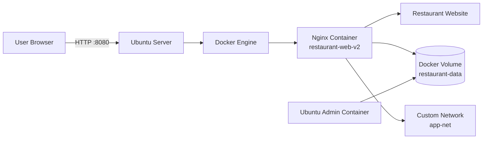

# docker-restaurant-website
Install Docker on Ubuntu, manage Docker images and containers, work with Docker volumes and networks, deploy a Restaurant Website using Nginx, and verify container operations.


# 🍽️ Docker Restaurant Website Deployment

<p align="center">


</p>

A complete hands-on Docker project demonstrating installation, container lifecycle management, Docker volumes, networking, and deployment of a static Restaurant Website using Nginx on Ubuntu.

---

# 📖 Project Overview

This project demonstrates:

- Docker Installation on Ubuntu
- Docker Images & Containers
- Docker Volumes
- Docker Networking (Bridge, Host & Custom)
- Nginx Website Deployment
- Persistent Storage
- Static Website Hosting
- Container Monitoring & Troubleshooting

---

# 🏗️ Architecture Diagram



---

# 📂 Repository Structure

```text
restaurant-project/
│
├── images/
│   └── restaurant.jpg
├── index.html
├── README.md
├── Docker_Restaurant_Website_Guide.md
└── restaurant-project.zip
```

---

# 🚀 Project Workflow

1. Install Docker
2. Pull Ubuntu & Nginx Images
3. Create Docker Volume
4. Deploy Ubuntu Container
5. Deploy Nginx Container
6. Configure Docker Networking
7. Deploy Restaurant Website
8. Upload Images
9. Verify Deployment
10. Package the Project

---

# 🛠️ Technology Stack

| Technology | Purpose |
|------------|---------|
| Ubuntu | Operating System |
| Docker | Container Platform |
| Nginx | Web Server |
| Linux CLI | Administration |
| Docker Volumes | Persistent Storage |
| Docker Networks | Container Communication |

---

# 📋 Project Phases

- Phase 1 – Prepare Ubuntu Server
- Phase 2 – Create Project Directory
- Phase 3 – Download Docker Images
- Phase 4 – Create Docker Volume
- Phase 5 – Create Ubuntu Administration Container
- Phase 6 – Deploy Nginx Website Container
- Phase 7 – Monitor Containers
- Phase 8 – Remove & Recreate Container
- Phase 9 – Configure Docker without sudo
- Phase 10 – Docker Networking
- Phase 11 – Custom Docker Network
- Phase 12 – Update Restaurant Website
- Phase 13 – Add Images
- Phase 14 – Verify Website
- Phase 15 – Package Project

➡️ See **Docker_Restaurant_Website_Guide.md** for complete commands and explanations.

---

# ⚡ Quick Start

```bash
git clone https://github.com/yourusername/docker-restaurant-website.git
cd docker-restaurant-website

sudo apt update
sudo apt install docker.io -y

docker pull ubuntu
docker pull nginx
```

---

# 🌐 Access the Website

```text
http://<Public-IP>:8080
```

---

# 🐳 Useful Docker Commands

| Task | Command |
|------|---------|
| Images | docker images |
| Running Containers | docker ps |
| All Containers | docker ps -a |
| Volumes | docker volume ls |
| Networks | docker network ls |
| Logs | docker logs restaurant-web-v2 |
| Inspect | docker inspect restaurant-web-v2 |

---

# 📸 Screenshots

Add screenshots here:

- Docker Images
- Docker PS
- Docker Networks
- Docker Volumes
- Website Homepage

---

# 🎯 Skills Demonstrated

- Docker Installation & Configuration
- Docker Images
- Docker Containers
- Docker Volumes
- Docker Networking
- Nginx Deployment
- Linux Administration
- Website Hosting
- Troubleshooting

---

# 📚 Learning Outcomes

- Install Docker on Ubuntu
- Deploy Containers
- Manage Persistent Volumes
- Configure Docker Networks
- Host Static Websites
- Monitor & Troubleshoot Containers

---

## 👨‍💻 Author

**Akash Kolhe**

- GitHub: https://github.com/akashkolhe
- LinkedIn: https://linkedin.com/in/akashkolhe1

⭐ If you found this project helpful, consider giving it a Star.
